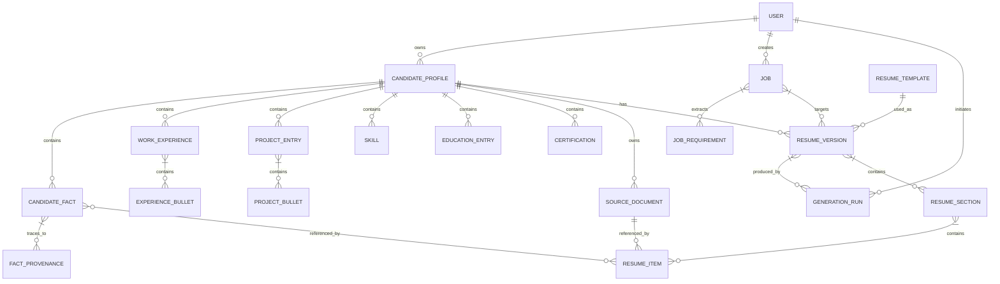

# Domain Model

## Overview

This document defines the **core entities**, their **relationships**, **source-of-truth rules**, **fact provenance model**, and **resume versioning model** for the AI Resume Builder.

---

## Core Entities

### User
```typescript
{
  id: string;                  // UUID (PK)
  email: string;               // Unique, verified
  name: string;                // Full name
  tenantId?: string;           // For enterprise/OIDC auth
  createdAt: Date;
  updatedAt: Date;
  lastLoginAt?: Date;
  preferences: UserPreferences;
}
```

### CandidateProfile
```typescript
{
  id: string;                  // UUID (PK)
  userId: string;              // FK → User.id, Unique
  personalInfo: PersonalInfo;
  summary?: string;            // User-authored summary
  visibility: 'PRIVATE' | 'PUBLIC_LINK';
  status: 'DRAFT' | 'FINALIZED';
  createdAt: Date;
  updatedAt: Date;
  archivedAt?: Date;
  latestProcessedAt?: Date;
}
```

### PersonalInfo
```typescript
{
  firstName: string;
  lastName: string;
  email?: string;
  phone?: string;
  location?: string;
  linkedinUrl?: string;
  portfolioUrl?: string;
  piiFields: PIIField[];       // Dynamic PII handling
}
```

### PIIField
```typescript
{
  path: string;                // e.g., "personalInfo.email"
  visibility: 'USER_ONLY' | 'HIRING_MANAGER' | 'PUBLIC';
}
```

### CandidateFact
```typescript
{
  id: string;                  // UUID (PK)
  profileId: string;           // FK → CandidateProfile.id
  sourceRef: string;           // Identifier from source document
  sourceLocation?: {
    pageNumber?: number;
    boundingBox?: [number, number, number, number];
    characterRange?: { start: number; end: number };
  };
  claim: string;               // The actual factual statement
  context: string;             // Surrounding text for disambiguation
  confidence: number;          // 0.0–1.0
  status: FactStatus;
  verificationNotes?: string;
  humanVerifierId?: string;
  verifiedAt?: Date;
  createdAt: Date;
  updatedAt: Date;
  category: FactCategory;      // WORK, SKILL, PROJECT, EDUCATION, CERTIFICATION, ACHIEVEMENT
  version: number;
}

type FactStatus = 'USER_PROVIDED' | 'EXTRACTED' | 'VERIFIED' | 'NEEDS_REVIEW' | 'REJECTED';
type FactCategory = 'WORK' | 'SKILL' | 'PROJECT' | 'EDUCATION' | 'CERTIFICATION' | 'ACHIEVEMENT';
```

### FactProvenance
```typescript
{
  factId: string;              // FK → CandidateFact.id (1:1)
  sourceId: string;            // Identifier from the source document
  extractionMethod: 'PDF_PARSER' | 'DOCX_PARSER' | 'OCR' | 'USER_INPUT';
  humanVerified: boolean;
  verificationNotes?: string;
  confidenceAtExtraction: number;
}
```

### WorkExperience
```typescript
{
  id: string;                  // UUID (PK)
  profileId: string;           // FK → CandidateProfile.id
  company: string;
  title: string;
  startDate: Date;
  endDate?: Date;
  location: string;
  factIds: string[];           // Array of CandidateFact.id
  bulletPoints: ExperienceBullet[];
}
```

### ExperienceBullet
```typescript
{
  id: string;                  // UUID (PK)
  experienceId: string;        // FK → WorkExperience.id
  text: string;
  factIds: string[];
  sourceReferences: SourceReference[];
}
```

### ProjectEntry
```typescript
{
  id: string;                  // UUID (PK)
  profileId: string;           // FK → CandidateProfile.id
  name: string;
  description: string;
  url?: string;
  githubUrl?: string;
  startDate: Date;
  endDate?: Date;
  factIds: string[];
  bulletPoints: ProjectBullet[];
}
```

### ProjectBullet
```typescript
{
  id: string;                  // UUID (PK)
  projectId: string;           // FK → ProjectEntry.id
  text: string;
  factIds: string[];
  sourceReferences: SourceReference[];
}
```

### Skill
```typescript
{
  id: string;                  // UUID (PK)
  profileId: string;           // FK → CandidateProfile.id
  name: string;
  category: string;            // TECHNICAL, SOFT, DOMAIN, TOOL
  yearsOfExperience?: number;
  proficiency: 'ENTRY' | 'JUNIOR' | 'INTERMEDIATE' | 'SENIOR' | 'EXPERT';
  factId: string;              // Link to the source fact (optional)
  verifiedAt?: Date;
}
```

### EducationEntry
```typescript
{
  id: string;                  // UUID (PK)
  profileId: string;           // FK → CandidateProfile.id
  institution: string;
  degree: string;
  fieldOfStudy: string;
  startDate: Date;
  endDate: Date;
  gpa?: number;
  factIds: string[];
}
```

### Certification
```typescript
{
  id: string;                  // UUID (PK)
  profileId: string;           // FK → CandidateProfile.id
  name: string;
  issuingOrganization: string;
  issueDate: Date;
  expiryDate?: Date;
  credentialId?: string;
  credentialUrl?: string;
  factIds: string[];
}
```

### SourceDocument
```typescript
{
  id: string;                  // UUID (PK)
  profileId: string;           // FK → CandidateProfile.id
  filename: string;
  mimetype: string;
  size: number;                // Bytes
  uploadDate: Date;
  storagePath: string;         // Blob storage path
  status: 'PENDING_PROCESSING' | 'PROCESSED' | 'FAILED';
  processingError?: string;
  extractedAt?: Date;
  checksum: string;            // SHA256
}
```

### Job
```typescript
{
  id: string;                  // UUID (PK)
  userId: string;              // FK → User.id
  source: 'TEXT_INPUT' | 'JOB_URL' | 'API_IMPORT';
  sourceUrl?: string;          // If scraped from a URL
  rawText: string;             // Original job description text
  title: string;
  company: string;
  location?: string;
  url?: string;
  extractedAt: Date;           // When AI analysis was done
  status: 'ANALYZED' | 'FAILED_ANALYSIS';
}
```

### JobRequirement
```typescript
{
  id: string;                  // UUID (PK)
  jobId: string;               // FK → Job.id
  type: 'HARD' | 'SOFT' | 'NICE_TO_HAVE';
  category: 'TECHNICAL' | 'EXPERIENCE' | 'SKILL' | 'EDUCATION' | 'SOFT';
  text: string;                // Normalized requirement text
  originalText: string;        // From the raw job description
  weight: number;              // 0.0–1.0 importance score
  matchedFactIds?: string[];   // Facts that satisfy this requirement
  coverageScore?: number;       // 0.0–1.0 how well covered
}
```

### ResumeTemplate
```typescript
{
  id: string;                  // UUID (PK) (slug-based)
  name: string;
  description: string;
  slug: string;                // URL-safe identifier
  schemaVersion: string;       // Template schema definition
  templateSchema: JSONSchema;  // Allowed sections and constraints
  previewImageUrl: string;
  category: 'PROFESSIONAL' | 'CREATIVE' | 'MINIMAL' | 'ACADEMIC';
  createdAt: Date;
  isActive: boolean;
}
```

### ResumeVersion
```typescript
{
  id: string;                  // UUID (PK)
  profileId: string;           // FK → CandidateProfile.id
  templateId: string;          // FK → ResumeTemplate.id
  jobId?: string;              // FK → Job.id (if job-tailored)
  versionNumber: number;       // Auto-incrementing per profile
  structuredData: ResumeContent; // JSON: { sections: Section[], styles: StyleOverrides }
  status: 'DRAFT' | 'GENERATED' | 'FINALIZED' | 'ARCHIVED';
  generationRunId?: string;    // FK → GenerationRun.id
  createdAt: Date;
  updatedAt: Date;
  storagePath?: string;        // Blob storage path for PDF
  pdfChecksum?: string;
  metrics?: ResumeMetrics;
  validationErrors?: ValidationError[];
}
```

### ResumeContent
```typescript
{
  sections: ResumeSection[];
  globalStyles: ResumeStyles;
  metadata: {
    factUsageMap: Record<string, ResumeFactUsage>;
    sourceCoverageMap?: Record<string, SourceCoverage>;
  };
}
```

### ResumeSection
```typescript
{
  id: string;
  type: 'SUMMARY' | 'EXPERIENCE' | 'PROJECT' | 'SKILL' | 'EDUCATION' | 'CERTIFICATION' | 'ACHIEVEMENT' | 'CUSTOM';
  title: string;
  order: number;
  items: ResumeItem[];
}
```

### ResumeItem
```typescript
{
  id: string;
  sourceFactIds?: string[];    // Back-reference to source CandidateFacts
  sourceReferences?: SourceReference[];
  content: string;             // Actual text content
  bulletPoints?: ResumeBullet[];
  metadata?: {
    characterCount?: number;
    lineCount?: number;
  };
}
```

### ResumeFactUsage
```typescript
{
  factId: string;
  resumeItemId: string;
  resumeItemField: string;     // e.g., "bulletPoints[0].text"
}
```

### SourceReference
```typescript
{
  sourceId: string;            // Document ID or URL
  pageNumber?: number;
  snippet: string;             // Exact text extract
  confidence?: number;
}
```

### GenerationRun
```typescript
{
  id: string;                  // UUID (PK)
  profileId: string;           // FK → CandidateProfile.id
  jobId?: string;              // FK → Job.id
  templateId: string;          // FK → ResumeTemplate.id
  startedAt: Date;
  completedAt?: Date;
  status: 'PENDING' | 'RUNNING' | 'COMPLETED' | 'FAILED' | 'CANCELLED';
  stages: GenerationStageLog[];
  errors?: string[];
}
```

### GenerationStageLog
```typescript
{
  stageName: string;           // e.g., "job_analysis", "fact_verification"
  startedAt: Date;
  completedAt: Date;
  status: 'STARTED' | 'COMPLETED' | 'FAILED' | 'SKIPPED';
  inputRefs?: string[];        // IDs of inputs used
  outputRefs?: string[];       // IDs of outputs produced
  modelVersion?: string;       // e.g., "gpt-4-32k-v1"
  promptVersion?: string;      // e.g., "v1.2"
  tokenCount?: TokenUsage;
  error?: string;
}
```

### TokenUsage
```typescript
{
  promptTokens: number;
  completionTokens: number;
  totalTokens: number;
  costEstimate: number;        // USD
}
```

---

## Relationships



---

## Source-of-Truth Rules

### 1. CandidateProfile is the Primary Source
- **All candidate facts derive from CandidateProfile or its linked CandidateFact records.**
- No resume can be generated without a valid CandidateProfile.
- PersonalInfo PII fields are the authoritative personal information set.

### 2. CandidateFact Provenance is Immutable
- **Each CandidateFact must have proof of origin in FactProvenance.**
- FactProvenance is write-once — modifications create a new provenance entry.
- Status transitions follow rules:
  ```
  USER_PROVIDED → VERIFIED
  EXTRACTED → NEEDS_REVIEW → VERIFIED | REJECTED
  REJECTED → NEEDS_REVIEW (only after user review)
  ```

### 3. ResumeVersion References Back to Facts
- **Every claim in a ResumeItem must reference at least one CandidateFact via `sourceFactIds`.**
- If no fact exists, the claim was user-typed in the editor and marked as such.
- The resume generator cannot invent facts — it must link to existing ones.

### 4. GenerationRun Tracks All AI Decisions
- **All AI outputs are traceable to a GenerationRun with stage logs.**
- Model version and prompt version are always recorded.
- Token usage and cost are logged for evaluation and billing.

### 5. JobRequirement Evidence Linking
- **Each JobRequirement contains `matchedFactIds` if relevant facts exist.**
- The absence of matched facts indicates a coverage gap, not an assumption.

---

## Fact Provenance Model

### Extraction Method Tracking
| Method | Description | Confidence Range |
|--------|-------------|------------------|
| PDF_PARSER | Structured PDF parsing | 0.8–1.0 |
| DOCX_PARSER | Word DOCX extraction | 0.8–1.0 |
| OCR | Image-based extraction | 0.5–0.9 |
| USER_INPUT | Manually entered | 1.0 (trusted) |

### Verification Workflow
```
1. FACT CREATED (via parser/user)
   → status: EXTRACTED | USER_PROVIDED
   → confidence: 0.5–1.0

2. AI VERIFICATION (during resume generation)
   → status: NEEDS_REVIEW
   → confidence: updated based on context

3. HUMAN REVIEW (in fact review UI)
   → status: VERIFIED | REJECTED
   → confidence: 0.9+ | 0.0

4. USAGE IN RESUME
   → Only VERIFIED or USER_PROVIDED facts with confidence ≥ 0.7
   → All others require explicit human confirmation
```

### Provenance Query API
```typescript
interface IFactProvenanceService {
  /**
   * Trace any fact back to its earliest source
   */
  getFullProvenance(factId: string): Promise<ProvenanceChain[]>;

  /**
   * Count how many resume claims depend on a fact
   */
  getDownstreamImpact(factId: string): Promise<number>;

  /**
   * Verify that fact status is valid for resume generation
   */
  canUseInResume(factId: string): Promise<boolean>;
}
```

---

## Resume Versioning Model

### Version Lifecycle
```
DRAFT → GENERATED → FINALIZED → ARCHIVED
```

### Rules:
1. **Each resume generation creates a new ResumeVersion** with incrementing `versionNumber`.
2. **DRAFT versions** can be edited; the editor updates the structured data JSON.
3. **Generated versions** are immutable (created by the AI workflow).
4. **Finalized versions** are locked and downloadable as PDF.
5. **Archived versions** are kept for historical reference.

### Diff Tracking
- Resume versions store **structured diffs** (add/remove/move sections/bullets).
- This allows reconstruction of what changed between versions.
- Diffs are derived from the JSON structure, not raw PDF comparison.

### PDF Storage
- **Each finalized ResumeVersion stores the PDF in Blob Storage.**
- `storagePath` stores the blob path.
- `pdfChecksum` allows integrity verification.
- **Soft delete**: `status` set to `ARCHIVED` instead of hard-deleting.

---

## Validation Rules

### PersonalInfo Validation
```
- firstName, lastName: Required, max 50 chars
- email: If provided, valid email format
- phone: If provided, E.164 format
- linkedinUrl, portfolioUrl: If provided, valid URL
- piiFields: All paths must reference valid nested keys in PersonalInfo or other entities
```

### CandidateFact Validation
```
- claim: Required, max 1000 chars
- context: Required, max 2000 chars
- confidence: Number between 0 and 1
- status transitions: Enforced by workflow rules
- sourceRef: Required, max 255 chars
- category: Required enum value
```

### ResumeContent Validation
```
- Required section order rules (defined per template)
- Character limits per section (defined by template schema)
- All factIds referenced must exist and be VERIFIED or USER_PROVIDED
- Bullet point count constraints
- Line count estimation for overflow checks
```

---

## Event Sourcing for Audit

### Audit Trail Events
```typescript
interface CandidateProfileAuditEvent {
  id: string;
  entityType: 'CandidateProfile' | 'CandidateFact' | 'ResumeVersion';
  entityId: string;
  profileId?: string;
  operation: 'CREATE' | 'UPDATE' | 'DELETE' | 'STATUS_CHANGE' | 'VERIFICATION';
  userId: string;
  changes: Record<string, { old?: any; new?: any }>;
  timestamp: Date;
  correlationId: string;
}
```

- Stored in PostgreSQL `audit_log` table
- Also streamed to Application Insights for alerting
- Enables rollback capability for fact status changes

---

## Future Extensions

### Potential Additions:
1. **Fact Groups**: Group related facts (e.g., all bullets from the same job)
2. **Multi-language Support**: Localized facts for international candidates
3. **Collaboration**: Shared profiles with team comments
4. **External Integrations**: Sync facts with LinkedIn, GitHub, etc.
5. **AI Explainability**: Why did the LLM select specific facts for a job

This domain model ensures data integrity, traceability, and a clear separation between AI-generated content and user-verified facts.